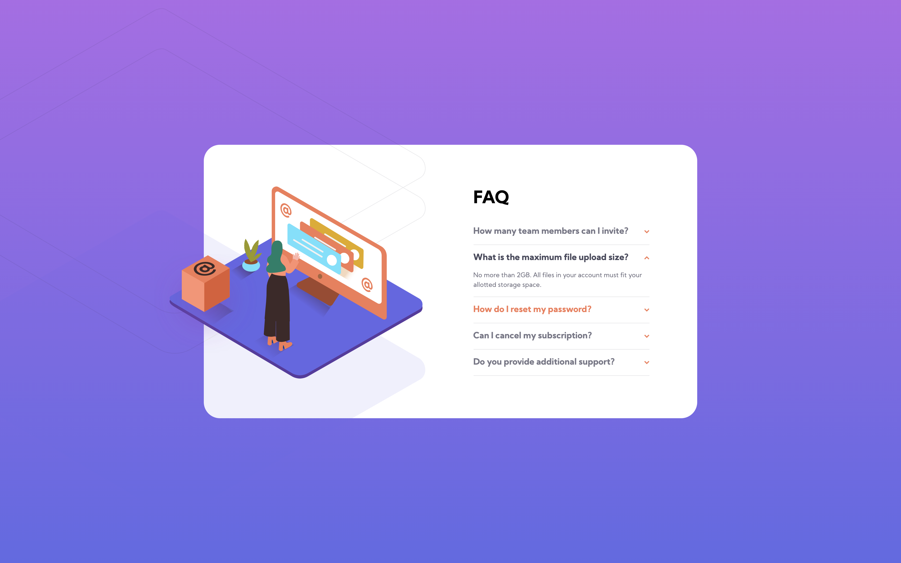
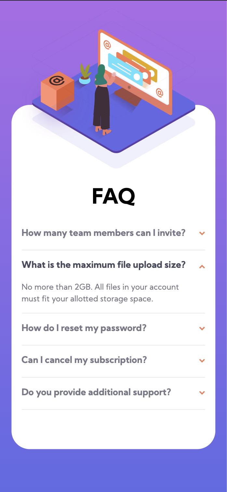

# Frontend Mentor - FAQ accordion card solution

## Table of contents

[toc]

## Overview

### The challenge

Users should be able to:

- View the optimal layout for the component depending on their device's screen size
- See hover states for all interactive elements on the page
- Hide/Show the answer to a question when the question is clicked

### Screenshot

### Link

https://qna-accordion-frontend-mentor.vercel.app/

## My process

### Built with

- Semantic HTML5 markup
- CSS custom properties
- Flexbox
- Mobile-first workflow

### What I learned

I've realized that I am not used to make responsive pages. I chose simple project but I got stuck several times. I needed to google a lot. Studying CSS is necessary for me.