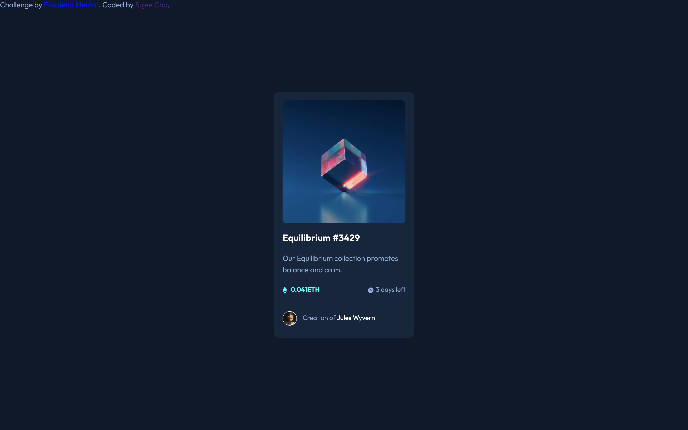
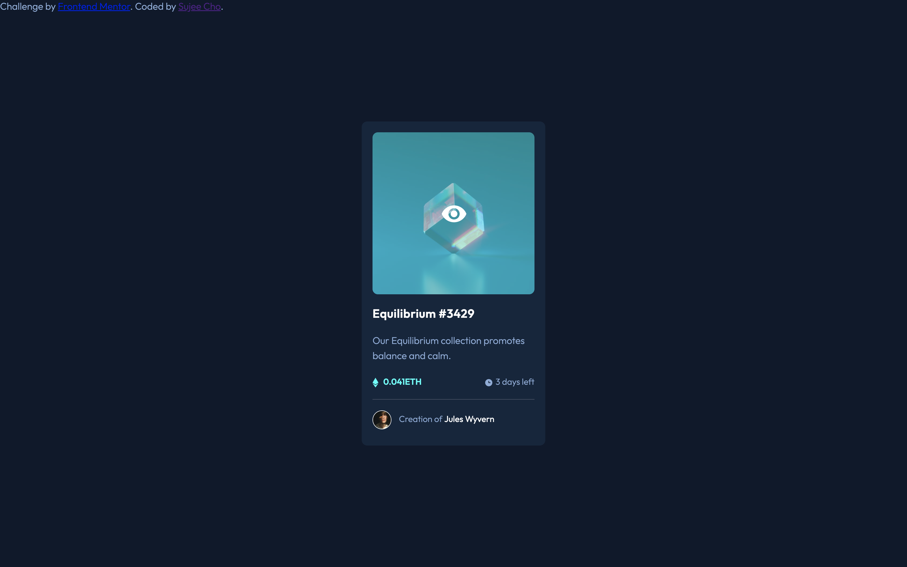
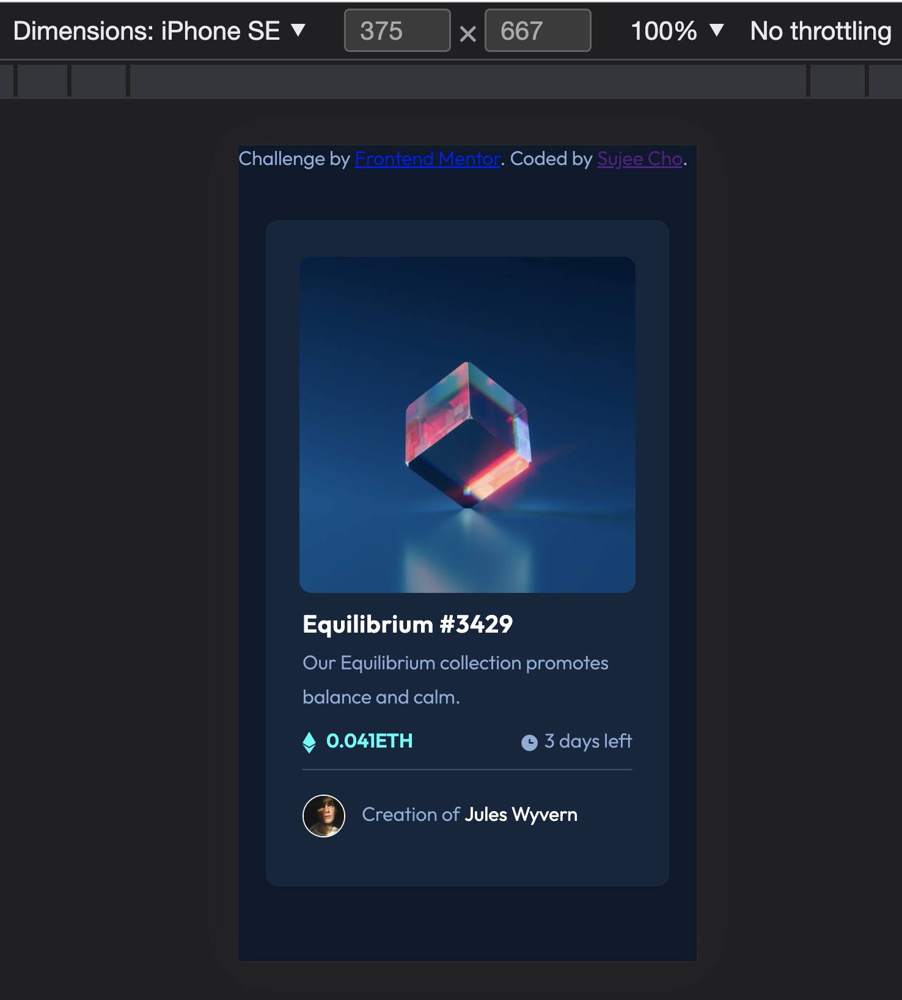

# Frontend Mentor - NFT preview card component solution

This is a solution to the [NFT preview card component challenge on Frontend Mentor](https://www.frontendmentor.io/challenges/nft-preview-card-component-SbdUL_w0U). Frontend Mentor challenges help you improve your coding skills by building realistic projects. 


## Overview

### The challenge

Users should be able to:

- View the optimal layout depending on their device's screen size
- See hover states for interactive elements

### Screenshot







### Links

https://github.com/ssj24/frontendMentor_sujee/tree/master/nft-preview-card-component-main

https://voluble-praline-b15f31.netlify.app/

## My process

### Built with

- Semantic HTML5 markup
- CSS custom properties
- Flexbox

### What I learned

1. make a div center horizontally and vertically

   ```css
   position: absolute;
   left: 50%;
   top: 50%;
   transform: translate(-50%, -50%);
   margin: auto;
   ```

   https://blog.hubspot.com/website/center-div-css

2. give a image `vertical-align: top/middle/bottom` to align image and text in same line

## Author

Frontend Mentor - [@ssj24](https://www.frontendmentor.io/profile/ssj24)
