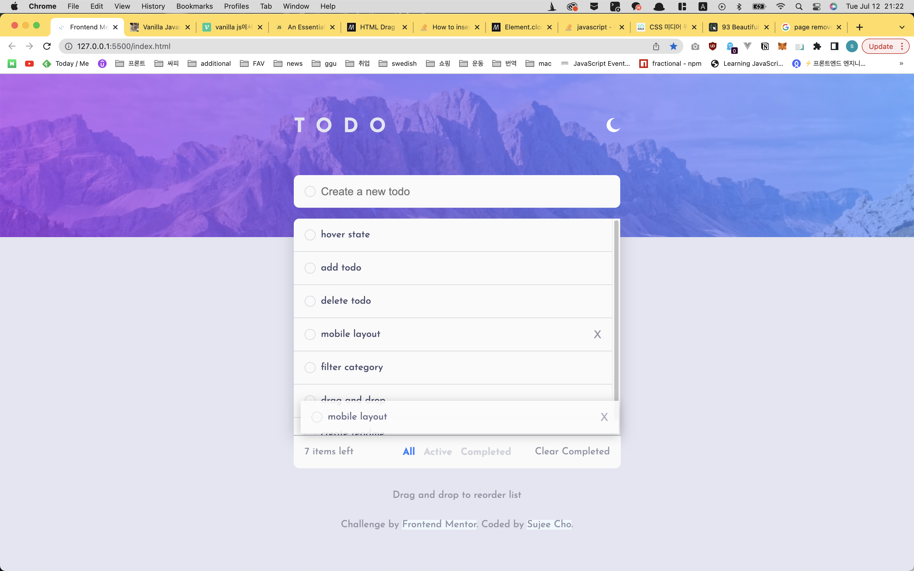
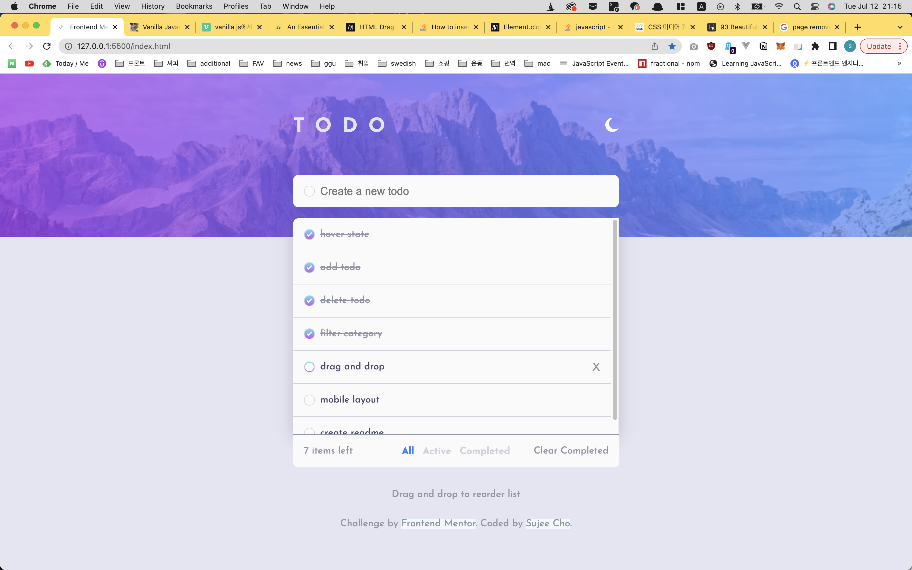
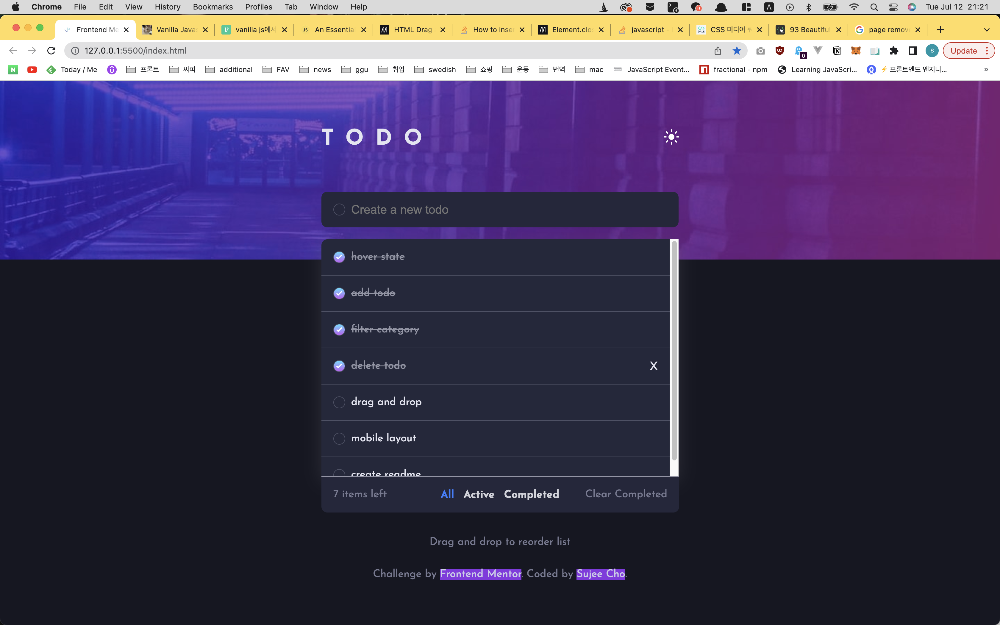
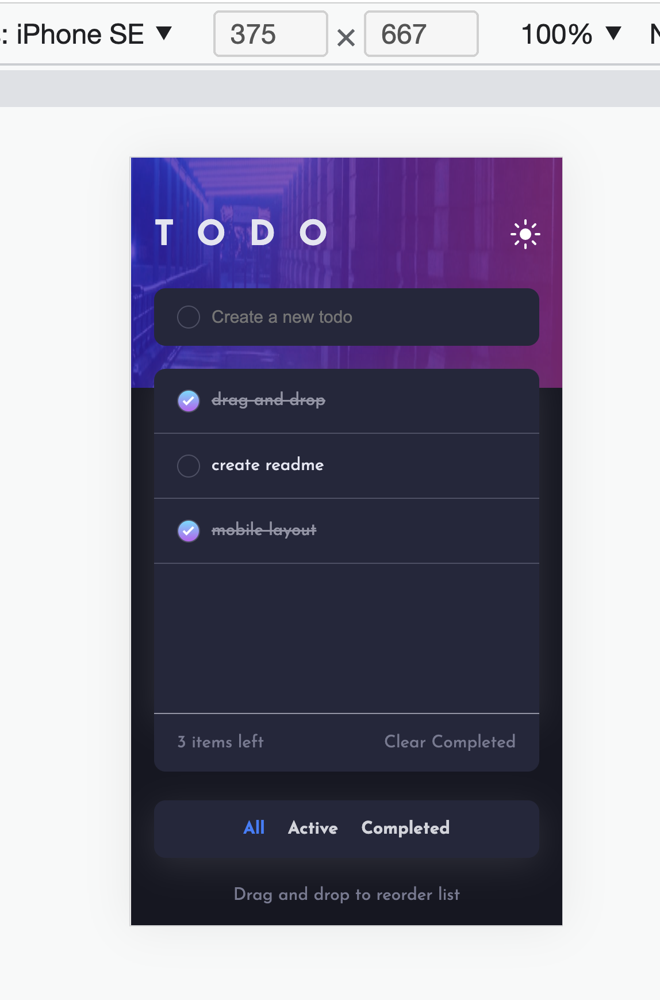
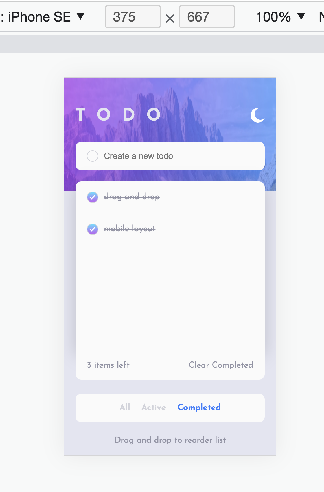

## Overview

### The challenge

Users should be able to:

- View the optimal layout for the app depending on their device's screen size

- See hover states for all interactive elements on the page

- Add new todos to the list

- Mark todos as complete

- Delete todos from the list

- Filter by all/active/complete todos

- Clear all completed todos

- Toggle light and dark mode

- Drag and drop to reorder items on the list

  

### Screenshot



Light theme page.

Users can drag and drop the todo item to rearrange the list.



Users can see the x button on the right of todo item by hovering the specific item.

By clicking todo item, change the state of todo.(active <=> complete)



This is dark theme.

Users can filter the todo items by their state.




Mobile layout of the todo app.

Category filters come out of the container.



Mobile light theme image.

If user click the `clear competed`, delete todos in complete state.


### Links

- Solution URL: [Github](https://github.com/ssj24/frontendMentor_sujee/tree/master/todo-app-main)
- Live Site URL: [Github Pages](https://ssj24.github.io/frontendMentor_sujee/todo-app-main/)


## My process

### Built with

- Semantic HTML5 markup

- CSS custom properties

- Flexbox

- SASS

- Mobile responsive

  

### What I learned

1. sass @function

   ```scss
   @function getValue($key1, $key2, $key3) {
     @return map-get(map-get($key1, $key2), $key3);
   }
   ```

   I used this function with theme colors.

   Since the theme object is nested, I need to overlap `map-get`.

2. drag and drop API

   I honestly didn't know there is basic drag and drop API.

   Need more study.

   

### Continued development

I want to import state management system within vanilla js.

Found out `proxy`. 


### Useful resources

- [css box shadows](https://getcssscan.com/css-box-shadow-examples) - This site offers 93 box shadows. 
- [HTML Drag and Drop API](https://developer.mozilla.org/en-US/docs/Web/API/HTML_Drag_and_Drop_API) - HTML drag and drop API doc.


## Author

- Website - [sujee cho](https://ssj24.github.io/)
- Frontend Mentor - [@ssj24](https://www.frontendmentor.io/profile/ssj24)
